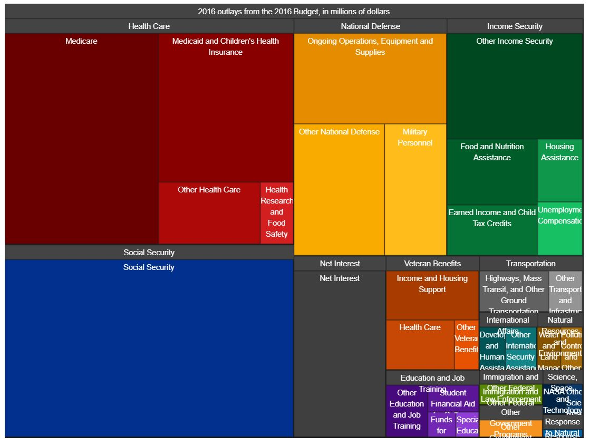
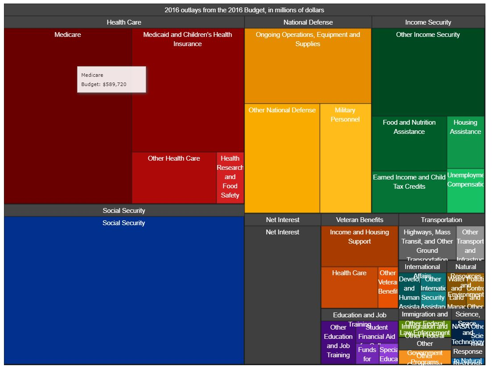
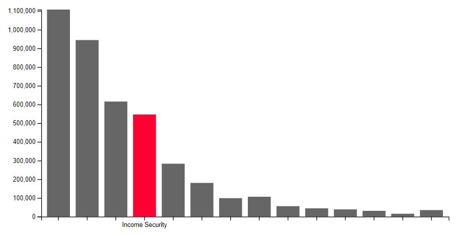
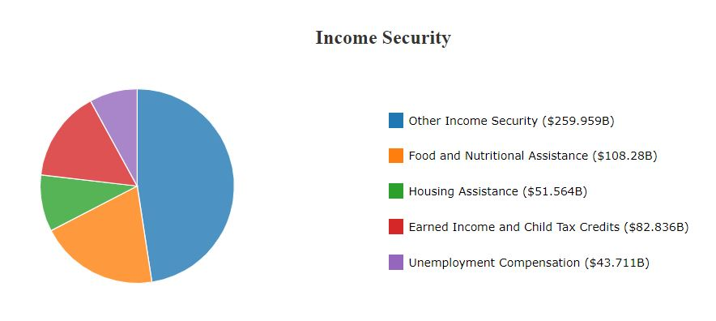
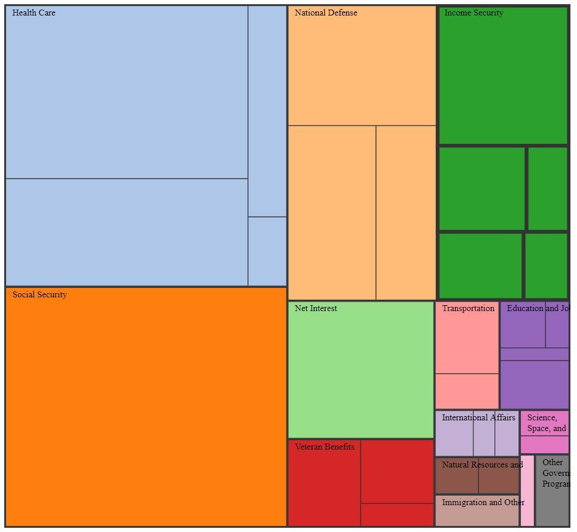
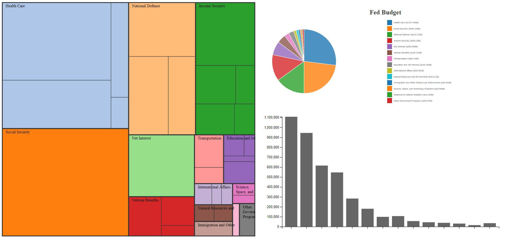
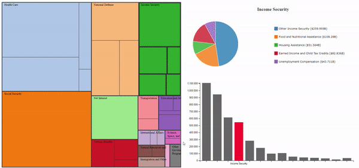

# Data Visualization Remix!
_This project aimed to better a previously made data visualization. I redesigned and built a breakdown of the 2016 Federal Budget submission by president Barack Obama, using D3.js to make it both more quanitative and understandable. The following outlines my process._

#### Developer: Harsh Rana 
[Link to project](https://hr23232323.github.io/04-Remix/)

---

### The Original
The original data visualization was built by the Office of Management and Budget, under the Obama Administration. It was intended to showcase the breakdown of the proposed budget and is showcased below-

  <kbd>     </kbd> 

The visualization is a treemap with different parts of the subsection broken up into different rectangles, based on the dollar amount alloted to them. 
 

Further, the visualziation also utilizes a hover-based tool tip to showcase individual categories and dollar amounts as can be seen below-

  <kbd>     </kbd>

The full version of this visualization can be found [here](https://obamawhitehouse.archives.gov/interactive-budget)

### Critique
One can see many different issues with the visualization type and treemap-based implementation. The budget breakdown is quantified using dollar amounts and the data would ideally have the following use cases-
1. Compare different major budget categories like Social Security and Health Care
2. Quantify the difference between different categories
3. Within a category, compare different spendings like Medicare and Health Research within Health Care
4. Compare spendings across different categories
5. Get a "feel" of the overall budget breakdown allotment accross all categories. 

The treemap-based approach has many shortcomings including the use of area encoding to showcase dollar amount difference. We already know that humans are fairly poor at quanitifying area differences. This makes use case #1 and #2 challenging. Additionally, comparing different spendings within or across categories is also fairly challenging as it involves hovering over the interesting spendings one by one and thus comparing. This makes use case #3 and #4 pretty challenging. The last use case is very well implemented by the data visualization as a tree map allows users to get a broad picture of the breakdown well. 

### The Redesign
To redesign this data visualization, I decided to focus on the above mentioned shortcomings and address them using different views. This would allow the data visualization to maintain the positives of the tree map, while allowing the user to compare and quantify differences more readily. 

To start off, I decided to address use-cases #1 and #2, which were based on comparison of major categories and quantification of the difference. I decided to use a bar chart to help a potential user with this task. A bar chart has been historically shown to be one of the most effective quantifying channels and was perfect for this part. As you can see on the left, I decided to emphasize the the highlighted category with a different color (and its label) while leaving the other bars out of focus to help the user both look at a single category in isolation and use hover-based changes to compare across different categories. 

 Next, I addressed use-cases #3 and #4, which relied on quantifying the breakdown within a category and across multiple categories. To achieve this, I decided to utilize a pie chart which can be seen on the right. While a pie chart is not as effective as a bar chart to showcase differences, using a pie chart enables the user to see the subcategory as part of the whole to both get a feel of the breakdown and also get the difference. Additionally, I also encoded the dollar amount in the legend to further help the user with quantifying difference. 

These two views, in addition to the original data visualization would help fill in information and effectiveness gaps, but before I was ready to put everything together, I wanted to redesign the treemap to be more minimal and remove excessive information which is now expressed in the other views. My implementation of the treemap, using d3 can be seen below-

  <kbd>     </kbd>

Very purposefully, I avoided the minor color encoding used in the original visualization as it achieves nothing (except for emphasizing different subcategories) and can be confusing for the user. Additionally, I decluttered some of the excess text on the treemap.

### The Final Design
Putting all the views mentioned above together was a fairly simple task using D3. I was able to use mouseover and mouseout events to bind the different views together. I maintained the tree map as the primary view and only utilized one-way binding. The final redesign can be seen below-

  <kbd>     </kbd>

When hovering over different categories, the differen views in the multiview dashboard really complement each other to help the user get more information and value from the visualization. This is showcased below-

  <kbd>     </kbd>

Your task is to choose a visualization and remix it.
By remix, we mean:

- Critique the original vis
- Redesign some aspect of it
- Implement your redesign

Examples of remixes include:
- taking a static choropleth map with a bad color scale, implementing a new version in d3, adding interactivity, and improving the color scale to show the original data in a more effective way
- finding a poorly designed or hard-to-use interactive visualization, and making a new version with easier to use navigation, features that enable the user to explore the data in new ways, and possibly adding new views

**Remember: the intent of this assignment is for you to demonstrate your understanding of the theory (e.g. concepts from Munzner's book) and practice (d3, and any tools you use for exploring the data) of visualization.**

Incorporating a brief writeup with your remix is a good idea.
Communicate what the original vis was, what the major issues were, and what new things can be seen with your redesign.
You could have text directly on the page, an "info" button, an about page, etc.

### Multiple Views (potentially useful info for certain remix directions)
One of the most powerful techniques for mitigating the shortcomings of a given visualization is to link it with other views.

Linking a map to a bar or scatterplot, for instance, may allow you to overcome the shortcomings of a map.

In general, linking visualizations allows you to explore different parts of the data between views, and mitigates the shortcomings of a given view by pairing it with other views.

Requirements
---

0. Your code should be forked from the GitHub repo and linked using GitHub pages.
1. Your project should load a dataset you found on the web from the vis you're remixing. You may extract the data by sight if necessary. Put this file in your repo.
2. Your project should use d3 to build a visualization of the dataset. 
3. Your writeup (readme.md in the repo) should contain the following:

- Working link to the visualization hosted on gh-pages.
- Concise description and screenshot of your visualization.
- Description of the technical achievements you attempted with this visualization.
- Description of the design achievements you attempted with this visualization.
