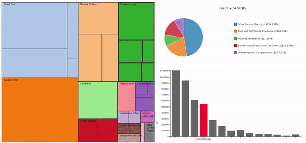

# Data Visualization Remix!
_This project aimed to better a previously made data visualization. I redesigned and built a breakdown of the 2016 Federal Budget submission by president Barack Obama, using D3.js to make it both more quanitative and understandable. The following outlines my process._

#### Developer: Harsh Rana 
[Link to project](https://hr23232323.github.io/04-Remix/)

---

## The Original
The original data visualization was built by the Office of Management and Budget, under the Obama Administration. It was intended to showcase the breakdown of the proposed budget and is showcased below-

  <kbd>     </kbd> 

The visualization is a treemap with different parts of the subsection broken up into different rectangles, based on the dollar amount alloted to them. 
 

Further, the visualziation also utilizes a hover-based tool tip to showcase individual categories and dollar amounts as can be seen below-

  <kbd>     </kbd>

The full version of this visualization can be found [here](https://obamawhitehouse.archives.gov/interactive-budget)

## Critique
One can see many different issues with the visualization type and treemap-based implementation. The budget breakdown is quantified using dollar amounts and the data would ideally have the following use cases-
1. Compare different major budget categories like Social Security and Health Care
2. Quantify the difference between different categories
3. Within a category, compare different spendings like Medicare and Health Research within Health Care
4. Compare spendings across different categories
5. Get a "feel" of the overall budget breakdown allotment accross all categories. 

The treemap-based approach has many shortcomings including the use of area encoding to showcase dollar amount difference. We already know that humans are fairly poor at quanitifying area differences. This makes use case #1 and #2 challenging. Additionally, comparing different spendings within or across categories is also fairly challenging as it involves hovering over the interesting spendings one by one and thus comparing. This makes use case #3 and #4 pretty challenging. The last use case is very well implemented by the data visualization as a tree map allows users to get a broad picture of the breakdown well. 

## The Redesign
To redesign this data visualization, I decided to focus on the above mentioned shortcomings and address them using different views. This would allow the data visualization to maintain the positives of the tree map, while allowing the user to compare and quantify differences more readily. 

To start off, I decided to address use-cases #1 and #2, which were based on comparison of major categories and quantification of the difference. I decided to use a bar chart to help a potential user with this task. A bar chart has been historically shown to be one of the most effective quantifying channels and was perfect for this part. As you can see on the left, I decided to emphasize the the highlighted category with a different color (and its label) while leaving the other bars out of focus to help the user both look at a single category in isolation and use hover-based changes to compare across different categories. 

 Next, I addressed use-cases #3 and #4, which relied on quantifying the breakdown within a category and across multiple categories. To achieve this, I decided to utilize a pie chart which can be seen on the right. While a pie chart is not as effective as a bar chart to showcase differences, using a pie chart enables the user to see the subcategory as part of the whole to both get a feel of the breakdown and also get the difference. Additionally, I also encoded the dollar amount in the legend to further help the user with quantifying difference. 

These two views, in addition to the original data visualization would help fill in information and effectiveness gaps, but before I was ready to put everything together, I wanted to redesign the treemap to be more minimal and remove excessive information which is now expressed in the other views. My implementation of the treemap, using d3 can be seen below-

  <kbd>     </kbd>

Very purposefully, I avoided the minor color encoding used in the original visualization as it achieves nothing (except for emphasizing different subcategories) and can be confusing for the user. Additionally, I decluttered some of the excess text on the treemap.

## Implementation
Putting all the views mentioned above together was a fairly simple task using D3. I was able to use mouseover and mouseout events to bind the different views together. I maintained the tree map as the primary view and only utilized one-way binding. The final redesign can be seen below-

  <kbd>     </kbd>

When hovering over different categories, the differen views in the multiview dashboard really complement each other to help the user get more information and value from the visualization. This is showcased below-

  <kbd>     </kbd>

## Achievements
We went above and beyond in this project, both from technical and design standpoints as shown below-

### Technical
Here's a description of my Technical Achievements for this project.
- **Data cleaning and processing script**: While the visualizations above look all good, the US federal government had a very, _very_ raw version of the data on their website. [Here's a link](https://github.com/WhiteHouse/budgetdata/blob/2016/data/outlays.csv) to the original raw data that I started with. In order to successfully recreate the treemap and create additional views, I had to write a script in python to categorize, aggregate and group relavent data from the raw CSV file. This file is also included in the repository where you can see the data manipulations that occured to recreate the original dataset.
- **Building Treemap using D3**: I utilized one of the more complex D3 techniques by creating a treemap from scratch. The method involved manipulating my original dataset to represent a node linked csv, learning and implementing the stratify() method to convert from CSV to node-linked tree, and utilizing D3 heirarchies to implement the treemap.
- **Multiview Binding**: I utilized hover and click-based events to bind the different views together. Additionally, I also imported different datasets for each of the views as they each needed different format of data. Moreover, I also passed relevant data between views to ensure that the focused view was expanded in the complementary views. 

 

### Design
Here's a description of my Design Achievements for this project.
- **CSS Flexbox for fluid layout**: I utilized CSS flexbox to create a fluid layout for my dashboard. I learnt the basics of creating flexbox-based designs and used many of those strategies to create designs which hold true even when resized (upto a certain degree). This will enable me to build more complex dashboards in the future. 
- **Visual Feedback**: While testing my data visualization by myself and through friends, I noticed that while the hover-binding enabled users to get a more wholistic view of the data, the lack of visual feedback in my earlier iterations also made it more confusing. Based on this, I modified my bar chart from having all colors to only highlighting the focused category. I also modified my treemap to increase the stroke around the category in focus. 
- **Redesigned Treemap**: Instead of blindly copying over the original treemap from the data visualization, I designed a more minimal and aesthetically pleasing version of the tree map that uses colors to differentiate between categories and area of differentiate between subcategories. 
